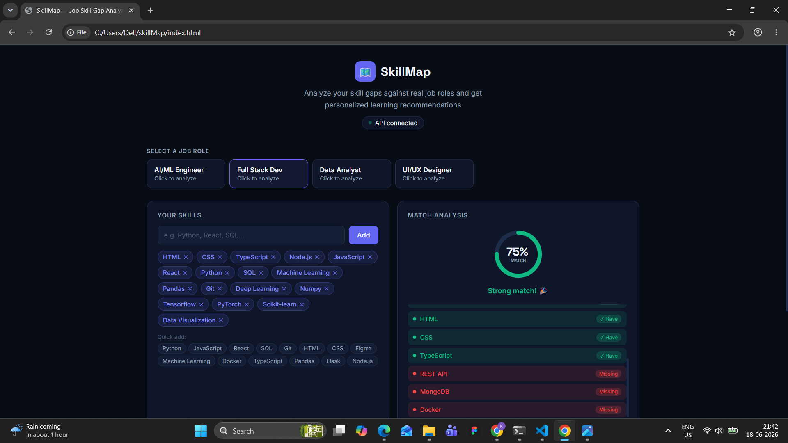
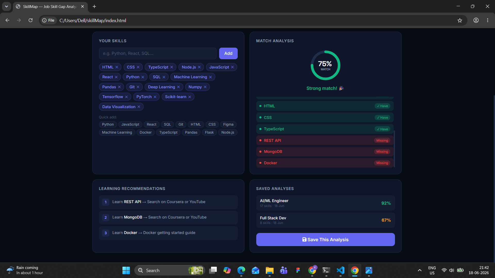

# skillMap
# 🗺️ SkillMap — AI Job Skill Gap Analyzer

> Analyze your skills against real job roles, get your 
> match percentage, and find exactly what to learn next.


## 🔗 Live Demo
- **Frontend:** [SkillMap App](https://ksusmitha879-cyber.github.io/skillMap/)
- **Backend API:** [API Docs](https://skillmap-y1bu.onrender.com/docs)

---

## 📌 Problem It Solves

Most job seekers don't know exactly which skills they're 
missing for a specific role. SkillMap analyzes your current 
skills against job requirements using ML and tells you 
precisely what to learn next.

---

## ✨ Features

- 🎯 **Skill Match Analysis** — Enter your skills, get a 
  match % against 6 job roles instantly
- 🤖 **ML-Powered Matching** — Uses TF-IDF vectorization 
  and cosine similarity to match skills intelligently  
- 📊 **Visual Match Ring** — Animated percentage ring 
  shows your match score at a glance
- 📋 **Skill Breakdown** — See exactly which skills you 
  have and which ones are missing
- 💡 **Learning Recommendations** — Get specific course 
  suggestions for each missing skill
- 💾 **Save Analyses** — Results saved to SQLite database, 
  accessible via history panel
- ⚡ **Auto API Docs** — FastAPI generates interactive 
  documentation at /docs automatically

---

## 📸 Screenshots

### Home — Select a Job Role
### Skill Analysis — Match Score
### Skill Breakdown — Matched vs Missing



### Saved History



---

## 🛠️ Tech Stack

| Layer | Technology | Purpose |
|---|---|---|
| Frontend | HTML · CSS · JavaScript | UI and user interaction |
| Backend | Python · FastAPI | REST API server |
| ML | Scikit-learn · TF-IDF | Skill matching algorithm |
| Database | SQLite | Saving analysis history |
| Docs | FastAPI Swagger | Auto-generated API docs |
| Hosting | GitHub Pages + Render | Free deployment |

---

## ⚙️ How It Works
User enters skills
↓
POST /api/analyze
↓
TF-IDF vectorizes user skills + job requirements
↓
Cosine similarity computes match score
↓
Returns: score % + matched skills + missing skills
↓
Frontend renders ring animation + skill breakdown
↓
User clicks Save → stored in SQLite via POST /api/save


---

## 🚀 Run Locally

### Backend
```bash
cd backend
python -m venv venv
venv\Scripts\activate        # Windows
pip install -r requirements.txt
python -m uvicorn app:app --reload
```

### Frontend
Open `frontend/index.html` with VS Code Live Server

### API will be live at:
http://127.0.0.1:8000/
http://127.0.0.1:8000/api/jobs
http://127.0.0.1:8000/api/analyze
http://127.0.0.1:8000/docs ← interactive API docs

---

## 📡 API Endpoints

| Method | Endpoint | Description |
|---|---|---|
| GET | `/` | Health check |
| GET | `/api/jobs` | Get all job roles |
| POST | `/api/analyze` | Analyze skill match |
| POST | `/api/save` | Save analysis to DB |
| GET | `/api/history` | Get saved analyses |

### Example Request
```json
POST /api/analyze
{
  "user_skills": ["Python", "SQL", "Pandas"],
  "job_role": "Data Analyst"
}
```

### Example Response
```json
{
  "job_role": "Data Analyst",
  "match_score": 42,
  "matched_skills": ["Python", "SQL", "Pandas"],
  "missing_skills": ["Tableau", "Power BI", "Excel",
                     "Statistics", "Matplotlib"],
  "total_required": 10
}
```

---

## 📁 Project Structure
skillmap/
├── backend/
│ ├── app.py ← FastAPI server + ML logic
│ ├── skillmap.db ← SQLite database (auto-created)
│ └── requirements.txt ← Python dependencies
├── frontend/
│ └── index.html ← Complete UI (HTML+CSS+JS)
├── screenshots/ ← README images
└── README.md

---

## 🧠 ML Approach

SkillMap uses **TF-IDF (Term Frequency-Inverse Document 
Frequency)** vectorization with **cosine similarity** to 
match user skills against job requirements.

This is the same technique used in real-world resume 
screening systems — making this project directly relevant 
to how actual ATS (Applicant Tracking Systems) work.

---

## 👩‍💻 Built By

**Karanam Susmitha**  
CS Graduate | AI/ML + Full Stack Developer  


[](https://www.linkedin.com/in/karanamsusmitha)
[](https://github.com/ksusmitha879-cyber)
